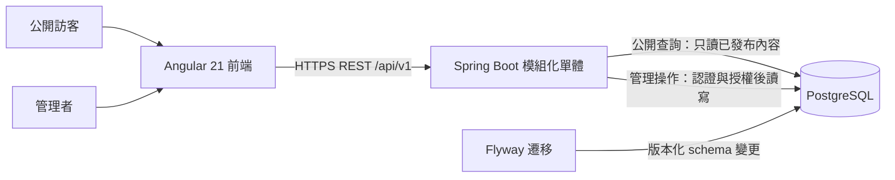

# 系統總覽

## 目標與邊界

Harbor of Fish 採前後端分離的 Web 架構，提供魚類、漁港與漁業文化內容的公開瀏覽，以及管理者維護內容的介面。前端與後端透過版本化 REST API 溝通；PostgreSQL 儲存持久資料。這份文件是建議架構，不代表 repository 已有對應程式或部署環境。

系統包含三個主要執行元件：

- **Angular 21 前端**：公開網站及管理介面，負責頁面呈現、使用者互動、表單輸入和 API 呼叫。瀏覽器不直接連線資料庫。
- **Spring Boot 後端**：提供 REST API、管理認證與授權、輸入驗證、領域規則和資料存取。公開查詢與管理操作共用一個模組化單體服務。
- **PostgreSQL**：儲存魚類、漁港、漁業文化內容及其關聯，也保存必要的管理資料。

Flyway 管理資料庫結構遷移，由後端部署流程套用版本化遷移。Angular 靜態前端與 Spring Boot API 可以分別建置、設定及部署；它們仍屬於同一產品，並遵循共同的 API 契約。

## 系統邊界與責任

| 部分 | 責任 | 不負責 |
| --- | --- | --- |
| Angular 前端 | 公開內容呈現、導覽與搜尋介面、管理者操作介面、表單及 API 錯誤呈現 | 存取 PostgreSQL、決定發布權限、作為安全性檢查的唯一依據 |
| Spring Boot API | 公開查詢、管理 CRUD、認證與授權、領域驗證、交易及資料存取 | 前端頁面排版與瀏覽器狀態管理 |
| PostgreSQL | 持久化及關聯式查詢 | API 權限判斷或直接服務瀏覽器 |
| Flyway | 以有序遷移管理 schema 變更 | 取代領域規則或應用程式資料驗證 |

所有管理端權限都由後端驗證。前端的路由或元件限制只改善操作體驗，不能代替 Spring Security 的存取控制。公開 API 只回傳已發布且可公開的內容。

## 模組化單體

初期以一個 Spring Boot 部署單元承載 API，依領域劃分內部模組，例如魚類、漁港、漁業文化與管理存取。各模組擁有清楚的服務責任，並透過明確的應用程式介面協作；不因領域數量而先拆成微服務。HTTP 控制器處理協定轉換，應用程式服務協調使用案例，領域規則維持內容與關聯的一致性，資料存取實作則封裝持久化細節。

公開查詢和管理寫入可以共用領域與資料存取能力，但應分開呈現其存取政策：公開讀取受發布狀態限制；新增、修改、發布及下架操作必須通過管理端授權。

## 主要資料流



公開瀏覽流程由 Angular 呼叫 `/api/v1` 公開查詢端點，後端依發布狀態篩選資料，再回傳適合呈現的資源。管理者透過管理介面送出 CRUD 或發布操作；Spring Security 先驗證身分及權限，後端再驗證輸入、套用領域規則並以交易寫入 PostgreSQL。回應經 REST API 回到前端。資料庫結構變更由 Flyway 依部署程序套用，不透過前端執行。

## 建議 monorepo 目錄

以下是未來可採用的組織方式，僅作為架構邊界參考；目前不建立程式骨架。

```text
.
├── frontend/                 # Angular 21 workspace：公開網站與管理介面
├── backend/                  # Spring Boot 模組化單體及後端測試
├── docs/                     # 架構與專案文件
├── infra/                    # 本機開發及部署所需的基礎設施設定
└── README.md
```

前端可在 `frontend/` 內依頁面或領域整理功能，並集中管理 API client 與共用 UI。後端可在 `backend/` 內按領域組織模組、應用服務、REST 介面及資料存取；Flyway 遷移由後端管理。`infra/` 可放置本機依賴服務及環境範例，避免將環境密碼提交到 repository。實際資料夾名稱可在建立專案骨架時再確定。

## 本機開發架構

建議本機執行 Angular 開發伺服器、Spring Boot API 與 PostgreSQL。Angular 以開發代理或明確的環境設定將 `/api` 請求轉送到本機 API，減少跨來源設定差異；前端不連線資料庫。PostgreSQL 可由本機服務或容器提供，並以專用本機資料庫供開發使用。後端啟動時依既定流程套用 Flyway 遷移。

各元件應透過設定讀取本機 API 位址、資料庫連線和必要的管理認證設定。提交設定範例時不得包含真實密碼或憑證。前端、後端與資料庫在本機彼此分開啟動，便於各自除錯；部署時則維持前端與後端可獨立交付的邊界。
